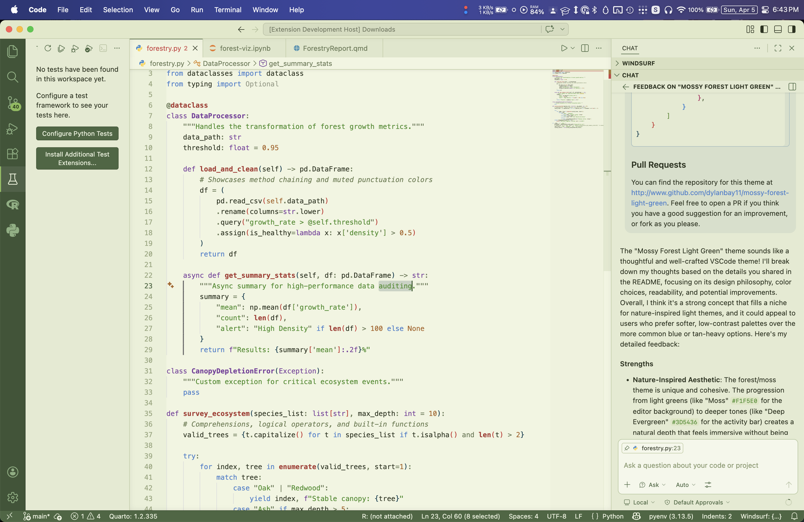
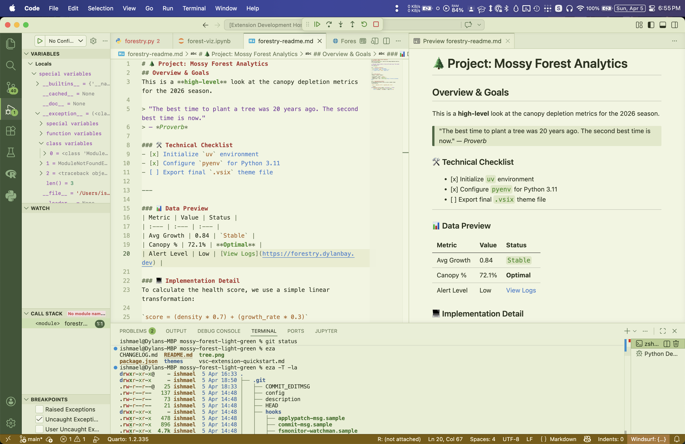
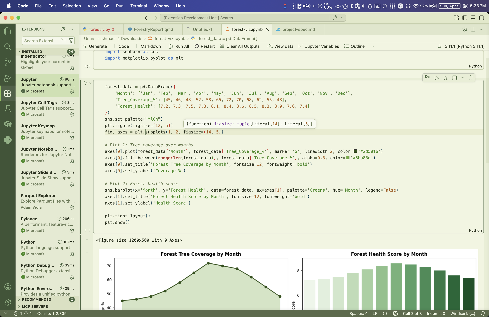

# Mossy Forest Light Green README

A soft, nature-inspired light theme designed for minimum eye fatigue and excellent readability. Mossy Forest Light Green swaps hard whites for a palette of muted earth tones, terracotta, sage, and amber, and fills a gap in existing themes which often ignore appealing green tones in favor of tans or blues. Supports Jupyter notebooks coloration out of box as well.

Theme by Dylan Bay.

## Screenshots


<hr />

<hr />


## Primary Design Choices

The major colors used include:

**Interface**

- Editor Background <span style="display:inline-block;width:12px;height:12px;background:#F1F5E0;border:1px solid #ccc;"></span> `#F1F5E0`, "Moss" — the primary writing surface, soft and low-glare.
- Sidebar <span style="display:inline-block;width:12px;height:12px;background:#E4EAD0;border:1px solid #ccc;"></span> `#E4EAD0`, "Understory" — one step darker than the editor to create gentle depth.
- Tab Bar <span style="display:inline-block;width:12px;height:12px;background:#DFE6CA;border:1px solid #ccc;"></span> `#DFE6CA`, "Canopy" — inactive tab area, slightly darker still.
- Activity Bar <span style="display:inline-block;width:12px;height:12px;background:#3D5436;border:1px solid #ccc;"></span> `#3D5436`, "Deep Evergreen" — anchors the left chrome in an appealing dark forest tone.
- Status Bar <span style="display:inline-block;width:12px;height:12px;background:#4A6741;border:1px solid #ccc;"></span> `#4A6741`, "Fern" — echoes the activity bar at a lighter shade to avoid looking too monochromatic.
- Hover/Definition Popups <span style="display:inline-block;width:12px;height:12px;background:#F7FAF0;border:1px solid #ccc;"></span> `#F7FAF0`, "Morning Mist" — the lightest surface, used for floating widgets.
- Panel & Terminal <span style="display:inline-block;width:12px;height:12px;background:#E8EED4;border:1px solid #ccc;"></span> `#E8EED4`, "Sage" — a hair darker to provide visual separation while keeping the same overall impact.

**Syntax**

- Plain Text <span style="display:inline-block;width:12px;height:12px;background:#2C3320;border:1px solid #ccc;"></span> `#2C3320`, "Dark Moss" — near-black with a green lean to match the theme without readability issues.
- Comments <span style="display:inline-block;width:12px;height:12px;background:#6B7D52;border:1px solid #ccc;"></span> `#6B7D52`, "Lichen" — clearly de-emphasized but readable and italic. See below for alternatives.
- Keywords <span style="display:inline-block;width:12px;height:12px;background:#4B83CD;border:1px solid #ccc;"></span> `#4B83CD`, "Cornflower" — confident blue, commonly used and also for links, to stay familiar. 
- Strings <span style="display:inline-block;width:12px;height:12px;background:#448C27;border:1px solid #ccc;"></span> `#448C27`, "Leaf" — a natural green that feels at home on the green base. I like it lighter like this, but you could darken it.
- Functions <span style="display:inline-block;width:12px;height:12px;background:#AA3731;border:1px solid #ccc;"></span> `#AA3731`, "Redwood" — muted brick red for clear function call visibility, looks nice slightly bold.
- Classes & Types <span style="display:inline-block;width:12px;height:12px;background:#7A3E9D;border:1px solid #ccc;"></span> `#7A3E9D`, "Thistle" — medium purple distinguishes type-level constructs without feeling out of place.
- Constants & Numbers <span style="display:inline-block;width:12px;height:12px;background:#AB6526;border:1px solid #ccc;"></span> `#AB6526`, "Soil" — warm earthy amber for literals and language constants, I think it blends well. 
- Operators & Punctuation <span style="display:inline-block;width:12px;height:12px;background:#6A7A56;border:1px solid #ccc;"></span> `#6A7A56`, "Sage Gray" — intentionally quiet and de-emphasized. See below for more standout alternatives.
- Doc Comments <span style="display:inline-block;width:12px;height:12px;background:#448C27;border:1px solid #ccc;"></span> `#448C27`, "Leaf" — same as strings, reinforcing that doc comments are content.

## Popular Tweaks

For a stronger, more neutral comment color, if the italics are currently too subtle for you, I recommend <span style="display:inline-block;width:12px;height:12px;background:#556644;border:1px solid #ccc;"></span> #556644.

For a slightly stronger selection highlight, I suggest <span style="display:inline-block;width:12px;height:12px;background:#AABF80;border:1px solid #ccc;"></span> #AABF80.

For more attention-grabbing operators, comparators, and punctuation, I suggest <span style="display:inline-block;width:12px;height:12px;background:#007A7C;border:1px solid #ccc;"></span> #007A7C ("Deep Water") for a middle ground or <span style="display:inline-block;width:12px;height:12px;background:#880E4F;border:1px solid #ccc;"></span> #880E4F ("Autumn Berry") for higher importance. Alternatively, you may choose merely to make these bold while keeping the original coloration.

To override these settings yourself, paste into `settings.json` some variant of the following with only the changes you want, which will trigger only when the theme is active:

```json
"workbench.colorCustomizations": {
    "[Mossy Forest Light Green]": {
        "editor.selectionBackground": "#AABF80AA",
        "editor.selectionHighlightBackground": "#AABF8055"
    }
},
"editor.tokenColorCustomizations": {
    "[Mossy Forest Light Green]": {
        "comments": "#556644",
        "textMateRules": [
            {
                "scope": "keyword.operator",
                "settings": {
                    "foreground": "#007A7C",  // or #880E4F
                    "fontStyle": "bold"         // optional
                },
            }
        ]
    }
}
```

## Pull Requests

You can find the repository for this theme at http://www.github.com/dylanbay11/mossy-forest-light-green. Feel free to open a PR if you think you have a good suggestion for an improvement, or fork as you please.